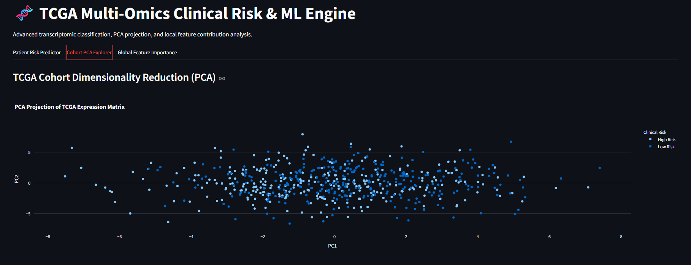
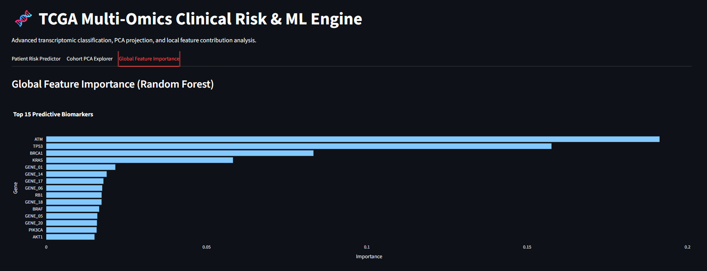
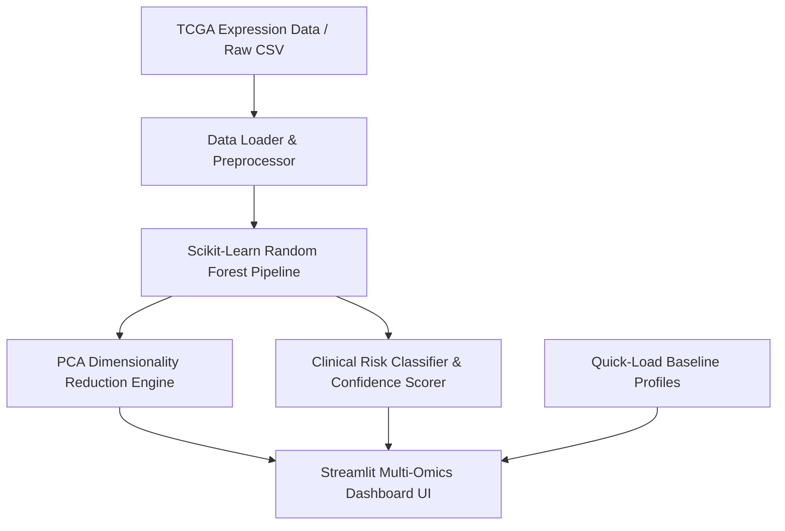

# 🧬 TCGA Multi-Omics Machine Learning & Clinical Risk Explorer

A production-grade bioinformatics machine learning platform built to classify patient clinical risk from high-dimensional transcriptomic expression profiles, featuring interactive dimensionality reduction (PCA) and global feature importance analytics.

---

## 📸 Platform Demonstration

Here is a visual overview of the TCGA Multi-Omics Disease Predictor dashboard in action:

<p align="center">
  
  
</p>

### 🎬 Video Walkthrough
Watch the full application demonstration and interactive workflow recording below:

<video width="100%" controls>
  <source src="public/Screen Record.mp4" type="video/mp4">
  Your browser does not support the video tag.
</video>

---

## 🔄 System Architecture & Data Flow



---

## 🌟 Architectural Pillars Met

1. **Technical Depth:** Features a modular `src/` architecture, Scikit-Learn Random Forest pipeline, Principal Component Analysis (PCA) projection, and automated unit testing (`unittest`).
2. **Relatable Friction:** Solves the bioinformatics bottleneck of exploring high-dimensional gene expression matrices and visualizing ML classifications without complex custom scripts.
3. **Content Modularization:** Designed for clean multi-part technical breakdown posts (Data pipeline, Model training & PCA, Streamlit UI engineering).
4. **Visual & Demo Impact:** Includes interactive Plotly scatter plots, probability confidence cards, and feature importance bar charts.
5. **Polish & Completeness:** Complete test suite, documentation, structured layout, and reproducibility scripts.

---

## 🚀 Quickstart

1. **Install Dependencies:**
   ```bash
   pip install -r requirements.txt
   ```

2. **Run Data Generation & Model Training Pipeline:**
   ```bash
   python src/data_loader.py
   python src/model_pipeline.py
   ```

3. **Execute Test Suite:**
   ```bash
   python tests/test_pipeline.py
   ```

4. **Launch Streamlit Dashboard:**
   ```bash
   streamlit run src/app.py
   ```
